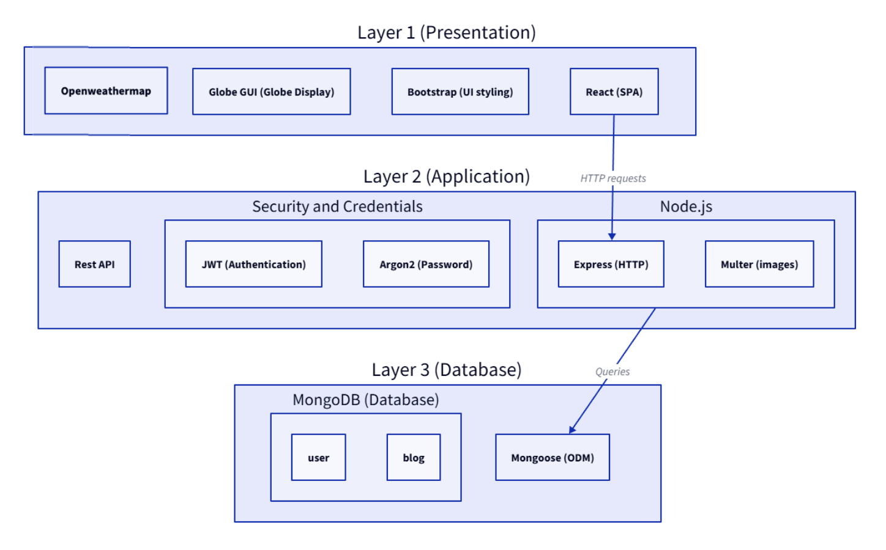

# WNDR
A full-stack application designed for travelers who want to document their trips, view their path on the globe, and share with others.

## Why we built this
The purpose for our app is to provide a visualization of a user’s travel experiences. By posting about their trip and location, the app's globe will populate with all of their experiences. This app is for anyone interested in documenting their travels and sharing it with others.

## Architecture


## Live Demo
Try the application live at https://wndr.onrender.com/

## MVP Features
* User can create an account
* User can login to an account
* User can create a new blog post 
* User can view their own blog posts
* User can view all user's blog posts
* User can view the globe that has all users' travel locations
* User can view the globe that has all their own travel locations and their home location
* User can search for specific blog posts 
* User can edit their profile to upload a profile image and change their home location

## Future Features
* User can follow another account 
* User can favorite other posts
* User can set post location by uploading a picture with location data
* User can enable a dark mode setting for the entire site

## Preview


## Development 

### System Requirements
* Node.js
* NPM
* MongoDB

### Getting Started
1. Clone the repository.
2. Install all dependencies with NPM.
  ```shell
    npm install
  ```
3. Make a copy of the provided server/.env.example file. Name your copy server/.env. Fill in your actual credentials and secrets.
4. Start the server.
```shell
    cd server
    npm start
  ``` 
5. Start the client.
```shell
    cd client
    npm start
  ``` 
